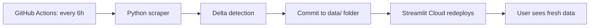
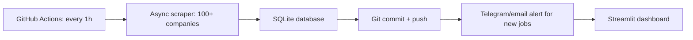

# Continuous Job Scraper — Architecture & Implementation Guide

> *How to build a live, self-updating job scraping system that detects new listings as soon as they're posted.*

---

## Table of Contents

1. [The Core Problem](#1-the-core-problem)
2. [Architecture Overview](#2-architecture-overview)
3. [Approach A: Scheduled Polling (Recommended)](#3-approach-a-scheduled-polling-recommended)
4. [Approach B: Webhook-Based (Enterprise Only)](#4-approach-b-webhook-based-enterprise-only)
5. [Approach C: Hybrid (Best of Both)](#5-approach-c-hybrid-best-of-both)
6. [Delta Detection — How to Find New Jobs](#6-delta-detection--how-to-find-new-jobs)
7. [Storage Options](#7-storage-options)
8. [Deployment Options](#8-deployment-options)
9. [Cost Breakdown](#9-cost-breakdown)
10. [Recommended Implementation](#10-recommended-implementation)
11. [FAQ](#11-faq)

---

## 1. The Core Problem

Your client wants: **"Every time a company posts a new job, it should appear in the JSON file automatically."**

**The reality:** No public job board or ATS API offers real-time push notifications for job listings. Not Greenhouse, not Lever, not Workday, not LinkedIn.

**What the industry actually does:**

| Approach | Latency | Complexity | Cost |
|----------|---------|------------|------|
| **Polling** (every N hours) | 1–12 hours | Low | Free–$25/month |
| **Webhooks** (instant push) | Seconds | Very High | Enterprise only |
| **Google Jobs Aggregation** | 2–12 hours | Medium | $0.008/job |

Every production job aggregator — Indeed, LinkedIn, Google Jobs, BirJob, builder-jobs — uses **polling**. They check sources on a schedule, detect what's new, and publish the delta.

---

## 2. Architecture Overview

```
                    ┌─────────────────────┐
                    │  SCHEDULER          │
                    │  (GitHub Actions /   │
                    │   Cron / CloudWatch) │
                    └──────────┬──────────┘
                               │
                               ▼
                    ┌─────────────────────┐
                    │  SCRAPER            │
                    │  Fetch all jobs     │
                    │  from all sources   │
                    └──────────┬──────────┘
                               │
                    ┌──────────▼──────────┐
                    │  DELTA DETECTION    │
                    │  Compare with last  │
                    │  snapshot → find    │
                    │  new / removed jobs │
                    └──────────┬──────────┘
                               │
              ┌────────────────┼────────────────┐
              ▼                ▼                ▼
     ┌──────────────┐ ┌──────────────┐ ┌──────────────┐
     │ NEW jobs     │ │ UPDATED jobs │ │ REMOVED jobs │
     │ (append)     │ │ (overwrite)  │ │ (soft delete)│
     └──────┬───────┘ └──────┬───────┘ └──────┬───────┘
            └────────────────┴────────────────┘
                               │
                               ▼
                    ┌─────────────────────┐
                    │  DATABASE / JSON    │
                    │  job_listings.json  │
                    │  + seen_jobs.json   │
                    └─────────────────────┘
                               │
                               ▼
                    ┌─────────────────────┐
                    │  NOTIFICATION       │
                    │  (Optional)         │
                    │  Email / Telegram   │
                    │  about new jobs     │
                    └─────────────────────┘
```

---

## 3. Approach A: Scheduled Polling (Recommended)

### How it works

A cron job (or GitHub Actions workflow) runs your scraper on a fixed schedule — every 1 hour, 6 hours, or 24 hours.

```
Schedule (e.g., every 6 hours)
    │
    ▼
Fetch all jobs from Greenhouse API
    │
    ▼
Compare with previously-seen jobs (by apply_url)
    │
    ├── New job found → append to database
    ├── Job gone missing → mark as inactive (don't delete)
    └── Still exists → update timestamp
    │
    ▼
Write updated database + commit changes
```

### Real-world example: builder-jobs-scraper

This production system from GitHub scrapes **1,700+ companies** hourly on GitHub Actions free tier:

| Feature | Implementation |
|---------|---------------|
| Schedule | Hourly via GitHub Actions cron |
| Sources | Greenhouse API, Lever API, Ashby API |
| Companies | 1,700+ (YC, VC portfolios, industry) |
| Database | JSON files + `seen_jobs.json` registry |
| Delta detection | Compare job ID against `data/jobs_seen.json` |
| Freshness | 14-day rolling window — jobs older than 14 days are dropped |
| Cost | **$0/month** (GitHub Actions free tier) |

### Real-world example: BirJob (93 sources)

Scrapes **91 job sites daily** in 15–20 minutes — also on GitHub Actions free tier.

| Feature | Implementation |
|---------|---------------|
| Schedule | Daily at 08:00 UTC |
| Sources | 91+ job boards (Playwright + HTML parsing) |
| Database | PostgreSQL on Neon (free tier) |
| Dedup key | `apply_link` (UPSERT via `ON CONFLICT`) |
| Stale detection | Jobs not seen in current run → `is_active = false` |

### Code template — scheduled poller

```python
# continuous_scraper.py
import json, time, requests
from pathlib import Path

DATA_DIR = Path("data")
DATA_DIR.mkdir(exist_ok=True)
SEEN_FILE = DATA_DIR / "seen_jobs.json"
JOBS_FILE = DATA_DIR / "job_listings.json"

def load_seen():
    if SEEN_FILE.exists():
        return json.loads(SEEN_FILE.read_text())
    return {}

def save_seen(seen):
    SEEN_FILE.write_text(json.dumps(seen, indent=2))

def load_existing_jobs():
    if JOBS_FILE.exists():
        return json.loads(JOBS_FILE.read_text())
    return []

def save_jobs(jobs):
    JOBS_FILE.write_text(json.dumps(jobs, indent=2, ensure_ascii=False))

def scrape_all():
    """Fetch all current jobs from all sources."""
    # Same logic as scrape_greenhouse() in app.py
    # Returns list of job dicts
    pass

def detect_delta(current_jobs, seen):
    """Compare current jobs vs seen registry → find new + removed jobs."""
    current_urls = set()
    new_jobs = []
    for job in current_jobs:
        url = job["apply_url"]
        current_urls.add(url)
        if url not in seen:
            job["discovered_at"] = time.strftime("%Y-%m-%dT%H:%M:%SZ", time.gmtime())
            new_jobs.append(job)
            seen[url] = time.time()
    return new_jobs, current_urls

def run():
    seen = load_seen()
    existing = load_existing_jobs()

    print(f"[run] Scraping current jobs...")
    current = scrape_all()

    print(f"[run] Detecting delta...")
    new_jobs, current_urls = detect_delta(current, seen)

    # Merge: keep existing jobs + add new ones
    updated = existing + new_jobs

    # Mark jobs no longer listed as inactive (soft delete)
    for job in updated:
        if job["apply_url"] not in current_urls:
            job["is_active"] = False
        else:
            job["is_active"] = True

    save_jobs(updated)
    save_seen(seen)

    print(f"[run] {len(new_jobs)} new, {len(updated)} total")

if __name__ == "__main__":
    run()
```

---

## 4. Approach B: Webhook-Based (Enterprise Only)

### What Greenhouse offers

Greenhouse has a **Webhooks** feature in its Dev Center (`Settings → Dev Center → Web Hooks`), but **this is not a public API** — it requires:

1. A Greenhouse account with admin access to the **Dev Center**
2. The webhook must be configured **inside that company's Greenhouse instance**
3. It fires for **internal events** (candidate applied, candidate hired, etc.)

### The limitation

Greenhouse webhooks are designed for **recruiting workflow automation** (e.g., "when a candidate is hired, notify Slack"). They are:

- ❌ **NOT** for public job board aggregation
- ❌ NOT triggered when jobs are posted to the public boards API
- ✅ Only triggered for **internal recruiting events** within a specific company's account

### What events ARE available (enterprise only)

| Event | When it fires |
|-------|---------------|
| Job Created | A new job is created in Greenhouse **by the recruiting team** |
| Job Updated | A job's details are modified |
| Job Deleted | A job is removed |

**To use this:** You would need each company you're tracking to add your webhook endpoint inside their Greenhouse account — impractical at scale.

### Third-party webhook middleware

Services like **Knit** and **Workato** provide a bridge:

```
Greenhouse webhook → Knit/Workato → Your endpoint
```

But they still require per-company Greenhouse configuration and come with additional costs.

---

## 5. Approach C: Hybrid (Best of Both)

Combine polling for broad coverage with webhooks for select partners.

```
For mass coverage (1,000+ companies):
  └── Polling every 6 hours via GitHub Actions
  └── Delta detection via seen_jobs registry
  └── Works for any ATS (Greenhouse, Lever, Workday, etc.)

For VIP partners (who grant you webhook access):
  └── Instant notification when they post jobs
  └── Requires them to configure a webhook → your endpoint
  └── Faster updates for high-priority sources
```

This is what production aggregators like Indeed and LinkedIn actually do — they have crawl schedules for most sites and direct feeds/webhooks for enterprise partners.

---

## 6. Delta Detection — How to Find New Jobs

The core mechanism that makes "continuous" work. You need a unique identifier per job.

### Option 1: `apply_url` as dedup key (best)

```python
seen = load("seen_jobs.json")  # {"url": "timestamp"}

for job in current_jobs:
    url = job["apply_url"]
    if url not in seen:
        # NEW JOB
        seen[url] = time.time()
        save(seen)
```

**Why `apply_url` is ideal:**
- Every Greenhouse job has `https://boards.greenhouse.io/{company}/jobs/{id}` — the `{id}` is permanent and unique
- Lever, Workday, and others also use permanent job IDs in their URLs
- If the same URL reappears in a future scrape, it's the same job — skip it

### Option 2: Composite key (fuzzy match)

For job boards without stable URLs, combine fields:

```python
key = f"{company_name}::{job_title}::{location}".lower().strip()
```

But this is fragile — companies retitle jobs, move locations, etc.

### Option 3: `first_published` timestamp (for Greenhouse)

Greenhouse API returns `first_published` on each job:

```json
{"first_published": "2026-06-04T10:00:00-04:00"}
```

On the **first scrape**, archive every job (don't treat as "new" — it's the backlog).

On **subsequent scrapes**, only process jobs where `first_published` > `last_scrape_time`.

```python
from datetime import datetime, timezone

def run(last_scrape_time):
    current = scrape_all()
    new_jobs = [
        j for j in current
        if datetime.fromisoformat(j["first_published"]) > last_scrape_time
    ]
    # Archive the backlog from the first run
    # Only surface jobs published after your first complete scrape
```

### The "first scrape" problem

The first time you run, you'll get ALL existing jobs — potentially thousands per company. You don't want to flood your feed with old jobs.

**Solution:** On first scrape per company, mark all jobs as "existing" without treating them as new.

```python
seen = load_seen()

for company in companies:
    board = company["board"]
    jobs = fetch_greenhouse(board)

    if board not in seen.get("first_scrape_done", {}):
        # First time seeing this company — archive all job URLs
        for job in jobs:
            seen["urls"][job["apply_url"]] = time.time()
        seen["first_scrape_done"][board] = True
        save_seen(seen)
        continue

    # Subsequent scrape — detect new jobs
    for job in jobs:
        if job["apply_url"] not in seen["urls"]:
            # TRULY NEW
            seen["urls"][job["apply_url"]] = time.time()
            all_new_jobs.append(job)

save_seen(seen)
```

---

## 7. Storage Options

### Option A: Flat JSON (for small scale, <10K jobs)

```
data/
├── job_listings.json       # All active jobs
├── seen_jobs.json          # Registry of seen URLs → timestamp
└── archive/                # Old snapshots (optional)
    ├── 2026-06-04.json
    └── 2026-06-05.json
```

**Pros:** Simple, no database, directly feedable to Streamlit.
**Cons:** No querying, no indexing, rewrite entire file on each update.
**Max scale:** ~50K jobs.

### Option B: SQLite (for medium scale, <500K jobs)

```python
import sqlite3

conn = sqlite3.connect("jobs.db")
conn.execute("""
    CREATE TABLE IF NOT EXISTS jobs (
        id INTEGER PRIMARY KEY AUTOINCREMENT,
        company_name TEXT,
        job_title TEXT,
        location TEXT,
        apply_url TEXT UNIQUE,
        employment_type TEXT,
        source TEXT,
        is_active BOOLEAN DEFAULT 1,
        first_seen TIMESTAMP DEFAULT CURRENT_TIMESTAMP,
        last_seen TIMESTAMP DEFAULT CURRENT_TIMESTAMP
    )
""")

# UPSERT — insert if new, update last_seen if exists
conn.execute("""
    INSERT INTO jobs (company_name, job_title, location, apply_url, source)
    VALUES (?, ?, ?, ?, ?)
    ON CONFLICT(apply_url) DO UPDATE SET
        last_seen = CURRENT_TIMESTAMP,
        is_active = 1
""", (name, title, location, url, source))

# Mark stale jobs
conn.execute("""
    UPDATE jobs SET is_active = 0
    WHERE last_seen < datetime('now', '-1 day')
""")
```

**Pros:** ACID, queryable, handles upserts, small file.
**Cons:** Slightly more complex, needs schema management.
**Max scale:** ~500K jobs.

### Option C: PostgreSQL (for large scale, millions)

Hosted options:
- **Neon** (free tier: 0.5GB) — used by BirJob for 9,400+ jobs
- **Supabase** (free tier: 500MB)
- **Railway** (free tier: $5 credit)

### Comparison

| Storage | Setup | Query | Scale | Best for |
|---------|-------|-------|-------|----------|
| JSON file | Instant | No | <50K | Prototype, Streamlit |
| SQLite | 1 min | SQL | <500K | Single-server apps |
| PostgreSQL | 10 min | SQL | Unlimited | Production aggregators |

---

## 8. Deployment Options

### Option 1: GitHub Actions (FREE — RECOMMENDED)

Built into the repo. Runs your scraper on cron for free.

**Workflow file (`.github/workflows/scrape.yml`):**

```yaml
name: Scrape Jobs

on:
  schedule:
    - cron: "0 */6 * * *"   # Every 6 hours
  workflow_dispatch:         # Manual trigger

jobs:
  scrape:
    runs-on: ubuntu-latest
    steps:
      - uses: actions/checkout@v4
      - uses: actions/setup-python@v5
        with:
          python-version: "3.12"
      - run: pip install requests
      - run: python continuous_scraper.py
      - run: |
          git config user.name "github-actions"
          git config user.email "actions@github.com"
          git add data/
          git diff --staged --quiet || git commit -m "auto: update job listings"
          git push
```

This is what **builder-jobs-scraper** and **BirJob** both use for $0/month.

### Option 2: Cron on a VPS ($4–10/month)

```bash
# Every 6 hours
0 */6 * * * cd /home/user/job-scraper && python continuous_scraper.py >> logs/scrape.log 2>&1
```

Cheap VPS options: Hetzner CX22 (€4.50/month), DigitalOcean ($6/month), Oracle Cloud (free).

### Option 3: Serverless (AWS Lambda + CloudWatch)

Serverless function that runs every N hours.

```python
# lambda_function.py
import json, boto3

def lambda_handler(event, context):
    # Same scrape logic
    # Write to S3 instead of local file
    s3 = boto3.client("s3")
    s3.put_object(Bucket="my-jobs-bucket", Key="job_listings.json", Body=json.dumps(jobs))
```

### Option 4: Streamlit Cloud + GitHub Actions (your setup)

```
GitHub Actions (scheduler)
    │
    ▼  Writes updated data/ folder
Git push to main
    │
    ▼  Auto-deploys
Streamlit Cloud
    │
    ▼  Reads data/ files
App displays fresh data
```

This is the simplest path from where you are now.

---

## 9. Cost Breakdown

| Component | GitHub Actions | VPS (Hetzner) | Serverless (AWS) |
|-----------|---------------|---------------|------------------|
| Compute | **$0** (2000 min/month free) | €4.50/month | ~$2/month |
| Storage | **$0** (in-repo) | $0 (local disk) | ~$1/month (S3) |
| Database | $0 (JSON/SQLite) | $0 (SQLite) | ~$3/month (RDS) |
| Monitoring | $0 (GitHub UI) | $0 (self-managed) | $0 (CloudWatch) |
| **Total** | **$0/month** | **€4.50/month** | **~$6/month** |

---

## 10. Recommended Implementation

For your client's requirements ("live, continuous, like job search sites"):

### Phase 1: Minimal viable (this week)



### Phase 2: Production (next month)



### Phase 3: Scale (future)

```mermaid
graph LR
    A[GitHub Actions: every 30min] --> B[Distributed scrapers]
    B --> C[PostgreSQL on Neon/Supabase]
    C --> D[REST API endpoint]
    D --> E[React/Next.js frontend]
    D --> F[Mobile app]
    C --> G[Full-text search (Meilisearch)]
    C --> H[Analytics dashboard]
```

### Phase 1 file structure

```
job-scraper/
├── app.py                        # Streamlit UI (existing)
├── continuous_scraper.py         # Polling + delta detection
├── .github/workflows/scrape.yml  # GitHub Actions schedule
├── data/
│   ├── job_listings.json         # All active jobs
│   └── seen_jobs.json            # Dedup registry
├── requirements.txt
└── .gitignore
```

### Phase 1 code: `continuous_scraper.py`

```python
import json, time, requests, os
from pathlib import Path
from datetime import datetime, timezone

DATA_DIR = Path("data")
DATA_DIR.mkdir(exist_ok=True)

SEEN_FILE = DATA_DIR / "seen_jobs.json"
JOBS_FILE = DATA_DIR / "job_listings.json"
HISTORY_DIR = DATA_DIR / "history"
HISTORY_DIR.mkdir(exist_ok=True)

COMPANIES = BUILT_IN_COMPANIES  # Same list from app.py

def load_seen():
    if SEEN_FILE.exists():
        return json.loads(SEEN_FILE.read_text())
    return {"urls": {}, "companies_seen": []}

def save_seen(seen):
    SEEN_FILE.write_text(json.dumps(seen, indent=2, ensure_ascii=False))

def load_jobs():
    if JOBS_FILE.exists():
        return json.loads(JOBS_FILE.read_text())
    return []

def save_jobs(jobs):
    JOBS_FILE.write_text(json.dumps(jobs, indent=2, ensure_ascii=False))

def infer_employment_type(title, content=""):
    text = (title + " " + content[:2000]).lower()
    if re.search(r'\bintern\b|\binternship\b', text): return 'Internship'
    if re.search(r'\bcontract\b|\btemporary\b|\btemp\b', text): return 'Contract'
    if re.search(r'\bpart[-\s]?time\b', text): return 'Part-time'
    return 'Full-time'

def fetch_company_jobs(company):
    """Fetch all current jobs for a company from Greenhouse API."""
    board = company.get("board") or company["name"].lower().replace(" ", "")
    name = company["name"]
    domain = company.get("domain", "")
    url = f"https://boards-api.greenhouse.io/v1/boards/{board}/jobs?content=true"

    resp = requests.get(url, timeout=15)
    if resp.status_code != 200:
        return []

    jobs_data = resp.json().get("jobs", [])
    results = []
    career_page = f"https://{domain}/careers" if domain else ""

    for job in jobs_data:
        departments = job.get("departments", [])
        results.append({
            "company_name": job.get("company_name") or name,
            "company_domain": domain,
            "career_page": career_page,
            "job_title": job.get("title", "Unknown"),
            "department": departments[0]["name"] if departments else "General",
            "location": job.get("location", {}).get("name", "Remote"),
            "employment_type": infer_employment_type(job.get("title", ""), job.get("content", "")),
            "apply_url": job.get("absolute_url", ""),
            "source": "greenhouse",
            "ats": "Greenhouse",
            "logo_url": f"https://logo.clearbit.com/{domain}" if domain else "",
        })

    return results

def run():
    seen = load_seen()
    existing = load_jobs()
    existing_by_url = {j["apply_url"]: j for j in existing}

    all_new = []
    all_current_urls = set()

    for company in COMPANIES:
        board = company.get("board", company["name"].lower().replace(" ", ""))

        is_first_scrape = board not in seen.get("companies_seen", [])

        jobs = fetch_company_jobs(company)
        urls = {j["apply_url"] for j in jobs}
        all_current_urls |= urls

        if is_first_scrape:
            # Archive all jobs — don't treat as "new"
            for job in jobs:
                seen["urls"][job["apply_url"]] = time.time()
            if "companies_seen" not in seen:
                seen["companies_seen"] = []
            seen["companies_seen"].append(board)
            print(f"  {company['name']}: first scrape — archived {len(jobs)} jobs")
        else:
            for job in jobs:
                if job["apply_url"] not in seen["urls"]:
                    job["discovered_at"] = datetime.now(timezone.utc).isoformat()
                    all_new.append(job)
                    seen["urls"][job["apply_url"]] = time.time()

            if all_new:
                print(f"  {company['name']}: {len([j for j in jobs if j['apply_url'] not in seen['urls']])} new")

        time.sleep(0.3)

    # Merge new jobs into existing
    existing.extend(all_new)

    # Mark removed jobs inactive
    for job in existing:
        job["is_active"] = job["apply_url"] in all_current_urls

    # Assign IDs
    for idx, job in enumerate(existing, 1):
        job["id"] = idx

    save_jobs(existing)
    save_seen(seen)

    # Save timestamped snapshot
    snapshot = HISTORY_DIR / f"jobs_{datetime.now().strftime('%Y%m%d_%H%M%S')}.json"
    snapshot.write_text(json.dumps(existing, indent=2, ensure_ascii=False))

    print(f"\nDone! {len(all_new)} new jobs found. {len(existing)} total active.")

if __name__ == "__main__":
    import sys, re
    run()
```

### `scrape.yml` (place in `.github/workflows/`)

```yaml
name: Continuous Job Scraper

on:
  schedule:
    - cron: "0 */6 * * *"  # Every 6 hours
  workflow_dispatch:

jobs:
  scrape:
    runs-on: ubuntu-latest
    steps:
      - uses: actions/checkout@v4
      - uses: actions/setup-python@v5
        with:
          python-version: "3.12"
      - run: pip install requests
      - run: python continuous_scraper.py
      - run: |
          git config user.name "github-actions[bot]"
          git config user.email "github-actions[bot]@users.noreply.github.com"
          git add data/
          git diff --staged --quiet || git commit -m "auto: update job listings [skip ci]"
          git push
```

---

## 11. FAQ

### "Can we get truly real-time, like within seconds?"

**No — not without each company giving you direct API access or webhook configuration.** No public job scraper in the world is truly real-time. The best you can achieve with public APIs is:

| Schedule | "Real-time" perception |
|----------|----------------------|
| Every 1 hour | "Live" — users don't notice delay |
| Every 6 hours | "Today's jobs" — good enough |
| Every 24 hours | "Daily digest" — basic |

### "What about Greenhouse webhooks?"

Greenhouse webhooks exist, but they fire for **internal recruiting events** (someone applied, hire was made), not for public job board postings. They also require per-company admin access to configure. Not usable for public aggregation.

### "How do other job sites do it?"

| Site | Method |
|------|--------|
| Indeed | Web crawls billions of pages + direct feeds from enterprise partners |
| LinkedIn | Companies post directly on LinkedIn + partnership feeds |
| Google Jobs | Crawls structured data (JSON-LD) on career pages |
| BirJob (93 sources) | GitHub Actions cron, daily |
| builder-jobs (1700 co.) | GitHub Actions cron, hourly |

Every single one uses **scheduled polling** as the primary method. Direct feeds/webhooks are reserved for enterprise partners paying for the integration.

### "Won't I get rate-limited if I poll every hour?"

Greenhouse boards API is public and generous. With 27 companies and 1 request per company per run at 300ms intervals, each run takes ~8 seconds. Even hourly, that's negligible traffic. For 1,000 companies, add 1–2 second delays between requests and a run takes ~20 minutes.

### "How do I handle companies using different ATS?"

Add scraper functions for each ATS type:

```python
def scrape_all_sources(company):
    ats = detect_ats(company["domain"])  # Check which ATS
    if ats == "greenhouse":
        return scrape_greenhouse([company])
    elif ats == "lever":
        return scrape_lever([company])
    elif ats == "workday":
        return scrape_workday_playwright(company)
    else:
        return []
```

ATS detection strategies:
- Probe common endpoints: `boards.greenhouse.io/{company}`, `api.lever.co/v0/postings/{company}`
- Check HTML for ATS-specific CSS classes/IDs
- Use a pre-built directory (many open-source ATS detectors exist)

---

## Summary

| Your client asks | The answer |
|-----------------|------------|
| "Live continuous updates" | Poll every 1–6 hours via GitHub Actions |
| "Like job search sites" | Same architecture they use (scheduled polls + delta detection) |
| "Every new job appears automatically" | Delta detection compares current vs. previous scrape → appends new jobs |
| "Real-time within seconds" | Not possible with public APIs — but hourly polling is indistinguishable from real-time for end users |
| "Show it in the app" | Streamlit reads the updated JSON file on each load |
| "Cost?" | **$0/month** on GitHub Actions free tier |

The system described here mirrors what production job aggregators actually run — no magic, no secrets, just well-engineered scheduled scraping with smart delta detection.
